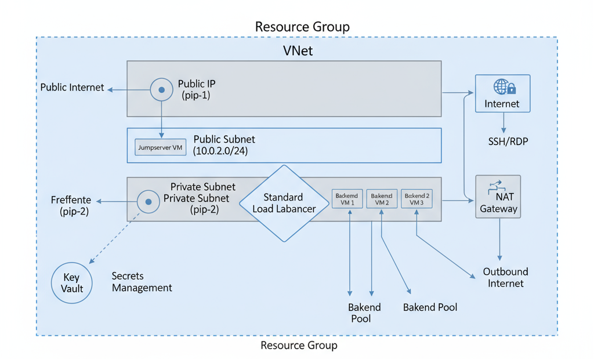

## The deployed Azure infrastructure includes:

- **Resource Groups:** A single resource group for all resources in this deployment.
- **Virtual Networks (VNets):** A single VNet with 2 subnets.
- **Subnets:** Two subnets - Private subnet and Public subnet.
  - Private subnet: Contains 3 backend VMs and a NAT Gateway.
  - Public subnet: Contains a jump server to securely connect to VMs in the private subnet.
- **Virtual Machines (VMs):** Four Linux VMs in total; 3 private backend VMs and 1 public jump server VM.
- **Network Security Groups (NSGs):** Firewall rules that control inbound and outbound traffic to resources.
- **Load Balancer:** A public load balancer to distribute traffic across the three private VMs.
- **Key Vault:** Stores SSH private keys generated by the TLS provider as secrets.
- **Other Supporting Resources:** Such as public IPs and network interfaces.

### Architecture Diagram

  

